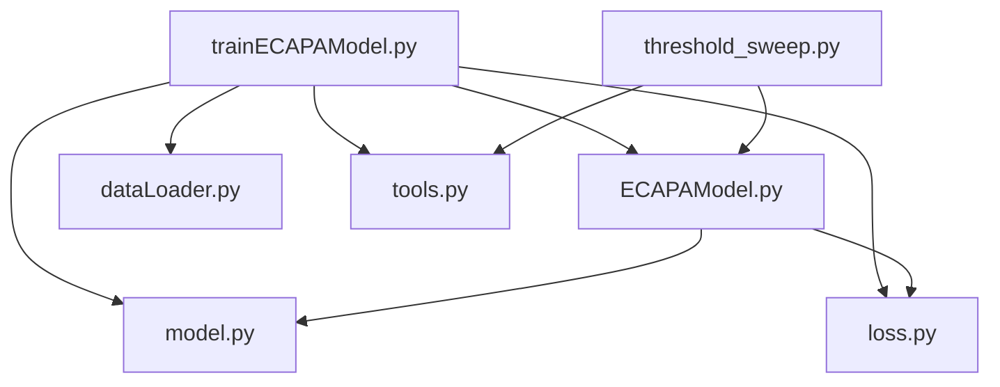

# ECAPA-TDNN Codebase Guide

This document explains the repository in the order you requested:
1. Start with the PDFs and the core ideas they teach.
2. Explain `ECAPAModel.py` first.
3. Then `trainECAPAModel.py`.
4. Then `threshold_sweep.py`.
5. Then `dataLoader.py`.
6. Then `loss.py`.
7. Then `model.py`.
8. Finally `tools.py`.

The goal is to make the whole codebase understandable from the tutorial concepts down to the exact scripts you run.

---

## 1. Read These PDFs First

### `System1.pdf`
This is the project-specific summary. It explains the exact evaluation workflow you have been building:
- pretrained ECAPA-TDNN evaluation
- fixed-threshold reports
- fine-grained threshold sweeps
- caching embeddings and scores
- generated CSV and plot outputs

This PDF is important because it explains the final behavior of your current codebase.

### `Deep learning based speaker recognition tutorial_Ruijie.pdf`
This is the conceptual foundation. It explains the full speaker-recognition pipeline:
- what speaker recognition is
- how training data is formatted
- how features are extracted
- why data augmentation helps
- how the speaker encoder is built
- how the loss function works
- how evaluation metrics are computed
- how thresholding and backend scoring work

If you understand this tutorial first, the code becomes much easier to follow.

### Concept Map From the Tutorial
- **Data format**: each training line maps a speaker ID to an audio file.
- **Feature extraction**: raw waveform is converted to Mel-spectrogram / filterbank features.
- **Data augmentation**: noise, music, speech, and reverberation are added to improve robustness.
- **Speaker model**: ECAPA-TDNN learns speaker embeddings.
- **Loss function**: AAM-Softmax pushes embeddings of the same speaker together and different speakers apart.
- **Evaluation**: embeddings are compared using similarity scores, then thresholds are swept to compute FAR, FRR, EER, and minDCF.

---

## 2. Project Structure at a Glance



- `trainECAPAModel.py` is the main entry point.
- `threshold_sweep.py` is the more structured evaluation/sweep utility.
- `ECAPAModel.py` connects the encoder, loss, training step, and evaluation logic.
- `dataLoader.py`, `loss.py`, `model.py`, and `tools.py` are support modules.

---

## 3. `ECAPAModel.py`

### What this file does
This file defines the main model class, `ECAPAModel`, which wraps:
- the ECAPA-TDNN encoder
- the AAM-Softmax classifier
- the optimizer and scheduler
- the training loop
- the evaluation loop
- saving and loading model weights

### Imports
```python
import torch, sys, os, tqdm, numpy, soundfile, time, pickle
import torch.nn as nn
import torch.nn.functional as F
from tools import *
from loss import AAMsoftmax
from model import ECAPA_TDNN
import matplotlib.pyplot as plt
import numpy as np
```

#### Explanation
- `torch` is the deep learning framework.
- `sys`, `os`, `time`, `pickle` support printing, paths, timestamps, and serialization.
- `tqdm` shows progress bars during evaluation.
- `numpy` and `np` handle arrays and numeric operations.
- `soundfile` reads WAV files.
- `torch.nn` and `torch.nn.functional` provide neural network building blocks.
- `tools import *` brings in evaluation helpers like `tuneThresholdfromScore`, `ComputeErrorRates`, and `ComputeMinDcf`.
- `AAMsoftmax` is the loss function.
- `ECAPA_TDNN` is the actual speaker encoder.
- `matplotlib.pyplot` is used for score and threshold plots.

### Class definition
```python
class ECAPAModel(nn.Module):
```

This creates a PyTorch module. It is a full speaker-recognition system, not just a single layer.

### `__init__`
```python
def __init__(self, lr, lr_decay, C , n_class, m, s, test_step, **kwargs):
```

#### What each argument means
- `lr`: optimizer learning rate.
- `lr_decay`: learning-rate decay factor.
- `C`: channel size for ECAPA-TDNN.
- `n_class`: number of speaker identities in training.
- `m`: AAM-Softmax margin.
- `s`: AAM-Softmax scale.
- `test_step`: how often to evaluate and decay learning rate.

#### Inside `__init__`
```python
self.speaker_encoder = ECAPA_TDNN(C = C).cuda()
```
- Creates the ECAPA-TDNN speaker encoder and moves it to GPU.
- This encoder converts audio to a speaker embedding.

```python
self.speaker_loss    = AAMsoftmax(n_class = n_class, m = m, s = s).cuda()
```
- Creates the classification loss used for training speaker embeddings.

```python
self.optim           = torch.optim.Adam(self.parameters(), lr = lr, weight_decay = 2e-5)
```
- Uses Adam optimizer.
- Weight decay helps regularization.

```python
self.scheduler       = torch.optim.lr_scheduler.StepLR(self.optim, step_size = test_step, gamma=lr_decay)
```
- Lowers the learning rate every `test_step` epochs.

```python
print(time.strftime("%m-%d %H:%M:%S") + " Model para number = %.2f"%(sum(param.numel() for param in self.speaker_encoder.parameters()) / 1024 / 1024))
```
- Prints the number of parameters in the speaker encoder.
- Dividing by `1024 * 1024` reports parameters in millions.

### `train_network`
```python
def train_network(self, epoch, loader):
```

This is the training loop for one epoch.

#### What it does
1. Switches the model to training mode.
2. Updates the learning rate scheduler.
3. Loops through batches from the data loader.
4. Moves labels to GPU.
5. Runs the encoder with augmentation enabled.
6. Computes AAM-Softmax loss and precision.
7. Backpropagates and updates weights.
8. Prints live training progress.

#### Important lines
```python
self.scheduler.step(epoch - 1)
```
- Updates the scheduler using the current epoch.

```python
speaker_embedding = self.speaker_encoder.forward(data.cuda(), aug = True)
```
- Converts the audio batch into embeddings.
- `aug=True` tells the encoder to use feature augmentation.

```python
nloss, prec = self.speaker_loss.forward(speaker_embedding, labels)
```
- Computes classification loss and top-1 accuracy.

```python
nloss.backward()
self.optim.step()
```
- Performs backpropagation and optimizer update.

### `eval_network`
```python
def eval_network(self, eval_list, eval_path):
```

This is the core evaluation routine.

#### What it does
1. Reads the trial list.
2. Collects all unique file names.
3. Loads each file and computes two embeddings:
   - full utterance embedding
   - split-utterance embedding
4. Compares embeddings pairwise for every trial.
5. Computes scores and labels.
6. Calculates EER and minDCF.
7. Generates score-distribution and threshold-sweep plots.
8. Caches scores and labels for later use.

#### Key evaluation logic
```python
audio, _  = soundfile.read(os.path.join(eval_path, file))
```
- Loads a WAV file.

```python
data_1 = torch.FloatTensor(numpy.stack([audio],axis=0)).cuda()
```
- Makes a 1-item batch from the full waveform.

```python
max_audio = 300 * 160 + 240
```
- Sets the fixed length used for split-window processing.

```python
feats = numpy.stack(feats, axis = 0).astype(numpy.float32)
```
- Builds 5 split segments from the utterance.

```python
embedding_1 = self.speaker_encoder.forward(data_1, aug = False)
embedding_2 = self.speaker_encoder.forward(data_2, aug = False)
```
- Computes embeddings for full and split views.

```python
score_1 = torch.mean(torch.matmul(embedding_11, embedding_21.T))
score_2 = torch.mean(torch.matmul(embedding_12, embedding_22.T))
score = (score_1 + score_2) / 2
```
- Computes similarity scores between the two utterances.
- A higher score means the pair is more likely to be the same speaker.

```python
EER = tuneThresholdfromScore(scores, labels, [1,0.1])[1]
```
- Computes EER using the helper from `tools.py`.

```python
fnrs, fprs, thresholds = ComputeErrorRates(scores, labels)
minDCF, _ = ComputeMinDcf(fnrs, fprs, thresholds, 0.05, 1, 1)
```
- Computes minDCF.

```python
self.cached_scores = scores
self.cached_labels = labels
```
- Stores the evaluation scores and labels so later threshold sweeps can reuse them.

### Plot helpers in this file
#### `plot_score_distributions(scores, labels)`
- Splits scores into genuine and impostor groups.
- Plots two histograms.
- Saves `exps/eval_gpu/score_distributions_updated.png`.

#### `fine_grained_threshold_sweep(scores, labels)`
- Sweeps thresholds from `-1.0` to `1.0` with step `0.001`.
- Computes FAR and FRR at each threshold.
- Saves `exps/threshold_results_updated.csv`.
- Plots FAR/FRR vs threshold and saves `exps/eval_gpu/far_frr_vs_threshold_updated.png`.

### Save/load helpers
```python
def save_parameters(self, path):
    torch.save(self.state_dict(), path)
```
- Saves all model parameters.

```python
def load_parameters(self, path):
```
- Loads weights from a saved checkpoint.
- Handles `module.` prefixes and shape mismatches safely.

### Example usage
```python
from ECAPAModel import ECAPAModel
model = ECAPAModel(lr=0.001, lr_decay=0.97, C=1024, n_class=5994, m=0.2, s=30, test_step=1)
model.load_parameters("exps/pretrain.model")
```

### How to think about this file
- `ECAPAModel.py` is the center of the project.
- It controls training, evaluation, caching, and checkpointing.
- If the model behavior is wrong, this is often the first file to inspect.

---

## 4. `trainECAPAModel.py`

### What this file does
This is the main entry script.
- It parses command-line arguments.
- It builds the loader when training.
- It loads the pretrained model.
- It runs evaluation or training depending on flags.
- It saves CSV reports and plots for fixed thresholds.

### Imports
```python
import argparse, glob, os, torch, warnings, time, sys
from tools import *
from dataLoader import train_loader
from ECAPAModel import ECAPAModel
import csv
import matplotlib.pyplot as plt
```

#### Explanation
- `argparse` defines CLI options.
- `glob` finds saved model files.
- `warnings` suppresses noisy warnings.
- `sys` is used for flushes so output appears immediately.
- `csv` writes reports.
- `matplotlib.pyplot` saves plots.

### `evaluate_fixed_thresholds`
This function uses the cached scores from `ECAPAModel.eval_network()` and computes metrics at chosen thresholds.

#### Example thresholds used in the current doc
- `0.1, 0.3, 0.9`
- `0.30, 0.31, 0.32, 0.33, 0.34`

#### What happens inside
1. Read `model.cached_scores` and `model.cached_labels`.
2. Compute FAR/FRR curves with `ComputeErrorRates`.
3. Find the closest threshold points.
4. Write CSV and plot outputs.

### Argument parsing
The script defines training and evaluation arguments such as:
- `--train_list`
- `--train_path`
- `--eval_list`
- `--eval_path`
- `--save_path`
- `--initial_model`
- `--eval`

### Training-only path
```python
if not args.eval:
    trainloader = train_loader(**vars(args))
    trainLoader = torch.utils.data.DataLoader(...)
```
- Builds the training loader only when not in evaluation mode.

### Evaluation path
```python
if args.eval == True:
    s = ECAPAModel(**vars(args))
    s.load_parameters(args.initial_model)
    EER, minDCF = s.eval_network(...)
```
- Loads a pretrained model.
- Runs the main evaluation.
- Then computes fixed-threshold reports.

### Output generation
The current script saves:
- `exps/eval_gpu/fixed_threshold_results.csv`
- `exps/eval_gpu/threshold_030_034_results.csv`
- `exps/eval_gpu/far_frr_vs_threshold_updated.png`
- `exps/eval_gpu/far_frr_vs_threshold_030_034.png`

### Important note about the current design
`trainECAPAModel.py` is convenient for quick runs, but `threshold_sweep.py` is the cleaner and more scalable script for threshold sweeps.

### Example use
```bash
python trainECAPAModel.py --eval \
  --initial_model exps/pretrain.model \
  --eval_list Datasets/veri_test2.txt \
  --eval_path Datasets \
  --save_path exps/eval_gpu
```

### How to think about this file
- Use this file when you want the project’s main entry point.
- For training, it is the normal launch script.
- For evaluation and report generation, it can be used, but `threshold_sweep.py` is the better dedicated tool.

---

## 5. `threshold_sweep.py`

### What this file does
This is the best file for systematic threshold analysis.
It is a standalone CLI tool that:
- loads the model
- reads the VoxCeleb1 trial list
- extracts embeddings
- scores speaker pairs
- sweeps thresholds
- saves a CSV report
- saves a JSON summary
- caches embeddings to disk

### Main concepts
This file is the most practical implementation of the tutorial’s evaluation chapter.
It directly matches the ideas of:
- evaluation data format
- scoring backend
- threshold sweep
- FAR/FRR/EER/minDCF analysis

### Important helper functions
#### `resolve_audio_path`
Builds the full path to each audio file.

#### `read_eval_list`
Reads the trial file and returns:
- a list of pairs `(label, file_one, file_two)`
- a sorted list of unique files to load

#### `read_audio`
Reads audio with `soundfile` and falls back to `torchaudio` if needed.
It also converts stereo to mono.

#### `build_split_segments`
Creates five fixed-length segments from each utterance.
This matches the evaluation strategy used in the model.

#### `model_signature` and `cache_key`
Create stable cache IDs from file paths and checkpoint metadata.
This keeps embedding caches tied to the correct model and evaluation set.

#### `extract_embeddings`
- Loads all unique utterances.
- Extracts full and split embeddings.
- Batches split segments for efficiency.
- Saves embeddings to a cache file if enabled.

#### `score_trials`
- Looks up embeddings for each pair.
- Computes the pair score.
- Returns score and label arrays plus row-level details.

#### `sweep_thresholds`
- Builds a threshold grid using `np.arange`.
- Computes decision outcomes for all thresholds at once.
- Returns FAR, FRR, and accuracy curves.

#### `save_threshold_csv`
Writes a detailed per-threshold table with:
- threshold
- FAR
- FRR
- accuracy
- EER summary
- minDCF summary
- best accuracy summary

### Command-line arguments
Important CLI options:
- `--initial_model`
- `--eval_list`
- `--eval_path`
- `--output_csv`
- `--summary_json`
- `--threshold_start`
- `--threshold_end`
- `--threshold_step`
- `--split_batch_size`
- `--cache_embeddings`
- `--no_cache_embeddings`

### Current defaults
- Threshold range: `0.1` to `1.0`
- Step: `0.1`
- Output CSV: `exps/threshold_results.csv`
- Summary JSON: `exps/threshold_summary.json`

### What `main()` does
1. Creates output directories.
2. Builds the model.
3. Loads the pretrained checkpoint.
4. Reads the trial list.
5. Extracts and caches embeddings.
6. Scores all trial pairs.
7. Sweeps thresholds.
8. Computes EER and minDCF.
9. Saves CSV and JSON reports.
10. Prints the summary.

### Example use
```bash
python threshold_sweep.py \
  --initial_model exps/pretrain.model \
  --eval_list Datasets/veri_test2.txt \
  --eval_path Datasets \
  --output_csv exps/threshold_results.csv \
  --summary_json exps/threshold_summary.json \
  --threshold_start 0.30 \
  --threshold_end 0.34 \
  --threshold_step 0.01
```

### How to think about this file
- Use this when you want structured threshold experiments.
- It is the best match for your current analysis work.
- It is more reproducible than ad-hoc threshold logic inside the training script.

---

## 6. `dataLoader.py`

### What this file does
This file creates the training data loader.
It:
- reads the training list
- maps speaker labels to integer IDs
- loads WAV files
- crops audio segments
- applies augmentation
- returns waveform tensors and labels

### Class: `train_loader`
```python
class train_loader(object):
```

This is a dataset-like object used by `torch.utils.data.DataLoader`.

### `__init__`
Key responsibilities:
- store paths
- discover MUSAN noise files
- discover RIR files
- read the training list
- assign integer labels to speakers

### Important fields
- `self.train_path`: root directory of training WAVs
- `self.num_frames`: crop length in frames
- `self.noisetypes`: augmentation categories
- `self.noiselist`: noise file buckets
- `self.rir_files`: impulse response files
- `self.data_list`: list of training file paths
- `self.data_label`: speaker label for each sample

### `__getitem__`
This method returns one training example.

#### Steps
1. Read the waveform.
2. Pad it if too short.
3. Randomly crop a fixed-length segment.
4. Apply a random augmentation type.
5. Return the tensor and the speaker label.

### Augmentation types
- `0`: original audio
- `1`: reverberation
- `2`: babble / speech noise
- `3`: music noise
- `4`: noise
- `5`: combined television-like noise

### `add_rev`
- Picks a random RIR file.
- Convolves the waveform with the impulse response.
- Simulates reverberation.

### `add_noise`
- Samples noise from MUSAN.
- Scales it by a random SNR.
- Mixes it into the clean waveform.

### Example usage
```python
from dataLoader import train_loader
loader = train_loader(train_list="Datasets/train_list.txt", train_path="Datasets", musan_path="musan", rir_path="rir", num_frames=200)
```

### How to think about this file
- This file controls data quality during training.
- If the model is unstable, augmentation or cropping here is often the reason.

---

## 7. `loss.py`

### What this file does
This file implements the **AAM-Softmax** loss.
It is crucial for learning discriminative speaker embeddings.

### Class: `AAMsoftmax`
```python
class AAMsoftmax(nn.Module):
```

### Parameters
- `n_class`: number of speakers
- `m`: angular margin
- `s`: scale factor

### Why this loss matters
AAM-Softmax pushes the model to:
- make same-speaker embeddings closer together
- make different-speaker embeddings farther apart

This is one of the core ideas behind modern speaker verification.

### Important parts
```python
self.weight = torch.nn.Parameter(torch.FloatTensor(n_class, 192), requires_grad=True)
```
- Stores class prototypes in embedding space.
- `192` matches the ECAPA-TDNN embedding dimension.

```python
cosine = F.linear(F.normalize(x), F.normalize(self.weight))
```
- Computes cosine similarity between embeddings and class weights.

```python
phi = cosine * self.cos_m - sine * self.sin_m
```
- Applies the angular margin.

```python
output = output * self.s
```
- Scales logits for stable training.

```python
loss = self.ce(output, label)
```
- Cross-entropy over the modified logits.

```python
prec1 = accuracy(output.detach(), label.detach(), topk=(1,))[0]
```
- Computes top-1 accuracy for monitoring.

### Example usage
```python
from loss import AAMsoftmax
criterion = AAMsoftmax(n_class=5994, m=0.2, s=30)
```

### How to think about this file
- If the embeddings are not separating well, the loss function is a prime suspect.
- This file encodes the margin-based classification objective.

---

## 8. `model.py`

### What this file does
This file defines the ECAPA-TDNN neural network architecture.
It is the speaker encoder used by the rest of the project.

### Main classes
- `SEModule`
- `Bottle2neck`
- `PreEmphasis`
- `FbankAug`
- `ECAPA_TDNN`

### `SEModule`
This is a squeeze-and-excitation block.
It learns channel-wise attention.

### `Bottle2neck`
This is a multi-scale residual block.
It is one of the main building blocks of ECAPA-TDNN.
It uses:
- multiple convolution branches
- residual connections
- batch normalization
- ReLU
- squeeze-and-excitation

### `PreEmphasis`
Applies a pre-emphasis filter to boost higher-frequency information.
This is a common audio preprocessing step.

### `FbankAug`
Applies masking along frequency and time axes.
This is feature augmentation similar to SpecAugment.

### `ECAPA_TDNN`
This is the full encoder.

#### Major steps in `__init__`
- Build filterbank extraction pipeline.
- Define convolution stem.
- Define three Bottle2neck layers.
- Define MFA-style aggregation layer.
- Define attention block.
- Define pooling and projection layers.

#### `forward(x, aug)`
1. Extract Mel features.
2. Log-compress them.
3. Normalize feature means.
4. Optionally apply augmentation.
5. Apply convolution stem.
6. Run through the multi-scale residual layers.
7. Concatenate layer outputs.
8. Apply attention pooling.
9. Form statistics embedding with mean and standard deviation.
10. Project to a 192-dimensional speaker embedding.

### Important output shape
The final embedding is `192`-dimensional.
That is what the loss and evaluation code work with.

### Example usage
```python
from model import ECAPA_TDNN
encoder = ECAPA_TDNN(C=1024)
```

### How to think about this file
- This is the actual feature-learning core of the project.
- Training quality and evaluation quality both depend on this encoder.

---

## 9. `tools.py`

### What this file does
This file holds shared utility functions.
It is used by nearly every other module.

### `init_args(args)`
Adds derived paths to the parsed CLI arguments:
- `args.score_save_path`
- `args.model_save_path`

Also creates the model directory if needed.

### `tuneThresholdfromScore(scores, labels, target_fa, target_fr=None)`
- Uses ROC curve logic to find thresholds for target false-accept rates or false-reject rates.
- Returns tuned thresholds and EER-related statistics.

### `ComputeErrorRates(scores, labels)`
- Sorts scores.
- Builds cumulative false-negative and false-positive curves.
- Returns FNRs, FPRs, and the threshold values used.

### `ComputeMinDcf(fnrs, fprs, thresholds, p_target, c_miss, c_fa)`
- Computes minimum detection cost.
- Uses miss and false-alarm costs.
- Returns the minimum cost and the threshold that achieves it.

### `accuracy(output, target, topk=(1,))`
- Standard top-k classification accuracy helper.
- Used by the loss module for monitoring.

### Example usage
```python
from tools import ComputeErrorRates, ComputeMinDcf
```

### How to think about this file
- This is the shared math and bookkeeping layer.
- If metrics are wrong, this file is often where to look.

---

## 10. How To Run The Project

### Important note about environments
- Use **WSL + conda** for the real GPU evaluation pipeline.
- Use **Windows PowerShell** for lighter smoke tests, imports, and CPU-only checks.
- The exact Python executable and environment paths differ.

---

## 11. WSL Setup And Run Commands

### A. WSL environment setup
```bash
cd /mnt/c/Users/Harini/Documents/GitHub/ECAPA-TDNN-1
source ~/miniconda3/etc/profile.d/conda.sh
conda activate ecapa
pip install pypdf
```

### B. Full pretrained evaluation
```bash
python trainECAPAModel.py \
  --eval \
  --initial_model exps/pretrain.model \
  --eval_list Datasets/veri_test2.txt \
  --eval_path Datasets \
  --save_path exps/eval_gpu
```

### C. Threshold sweep script
```bash
python threshold_sweep.py \
  --initial_model exps/pretrain.model \
  --eval_list Datasets/veri_test2.txt \
  --eval_path Datasets \
  --output_csv exps/threshold_results.csv \
  --summary_json exps/threshold_summary.json \
  --threshold_start 0.30 \
  --threshold_end 0.34 \
  --threshold_step 0.01
```

### D. Smoke test `ECAPAModel.py`
```bash
python - <<'PY'
from ECAPAModel import ECAPAModel
print('ECAPAModel import OK')
PY
```

### E. Smoke test `dataLoader.py`
```bash
python - <<'PY'
from dataLoader import train_loader
print('train_loader import OK')
PY
```

### F. Smoke test `loss.py`
```bash
python - <<'PY'
import torch
from loss import AAMsoftmax
loss_fn = AAMsoftmax(n_class=10, m=0.2, s=30)
x = torch.randn(2, 192).cuda()
y = torch.tensor([0, 1]).cuda()
loss, acc = loss_fn(x, y)
print(loss.item(), acc.item())
PY
```

### G. Smoke test `model.py`
```bash
python - <<'PY'
import torch
from model import ECAPA_TDNN
model = ECAPA_TDNN(C=1024).cuda()
x = torch.randn(1, 16000).cuda()
y = model(x, aug=False)
print(y.shape)
PY
```

### H. Smoke test `tools.py`
```bash
python - <<'PY'
from tools import ComputeErrorRates
print('tools import OK')
PY
```

---

## 12. Windows PowerShell Setup And Run Commands

### A. Windows environment setup
If you want to use the local project venv:
```powershell
cd C:\Users\Harini\Documents\GitHub\ECAPA-TDNN-1
.\.venv-1\Scripts\python.exe -m pip install pypdf
```

### B. Full pretrained evaluation in Windows PowerShell
If you have the same data paths available and a compatible environment:
```powershell
cd C:\Users\Harini\Documents\GitHub\ECAPA-TDNN-1
wsl -d Ubuntu-22.04 -- bash -lc "cd /mnt/c/Users/Harini/Documents/GitHub/ECAPA-TDNN-1 ; source ~/miniconda3/etc/profile.d/conda.sh ; conda activate ecapa ; python trainECAPAModel.py --eval --initial_model exps/pretrain.model --eval_list Datasets/veri_test2.txt --eval_path Datasets --save_path exps/eval_gpu"
```

### C. Threshold sweep from Windows PowerShell
```powershell
cd C:\Users\Harini\Documents\GitHub\ECAPA-TDNN-1
wsl -d Ubuntu-22.04 -- bash -lc "cd /mnt/c/Users/Harini/Documents/GitHub/ECAPA-TDNN-1 ; source ~/miniconda3/etc/profile.d/conda.sh ; conda activate ecapa ; python threshold_sweep.py --initial_model exps/pretrain.model --eval_list Datasets/veri_test2.txt --eval_path Datasets --output_csv exps/threshold_results.csv --summary_json exps/threshold_summary.json --threshold_start 0.30 --threshold_end 0.34 --threshold_step 0.01"
```

### D. Windows smoke checks
#### `ECAPAModel.py`
```powershell
cd C:\Users\Harini\Documents\GitHub\ECAPA-TDNN-1
.\.venv-1\Scripts\python.exe -c "from ECAPAModel import ECAPAModel; print('ECAPAModel import OK')"
```

#### `dataLoader.py`
```powershell
cd C:\Users\Harini\Documents\GitHub\ECAPA-TDNN-1
.\.venv-1\Scripts\python.exe -c "from dataLoader import train_loader; print('train_loader import OK')"
```

#### `loss.py`
```powershell
cd C:\Users\Harini\Documents\GitHub\ECAPA-TDNN-1
.\.venv-1\Scripts\python.exe -c "import torch; from loss import AAMsoftmax; loss_fn = AAMsoftmax(n_class=10, m=0.2, s=30); x = torch.randn(2, 192); y = torch.tensor([0, 1]); loss, acc = loss_fn(x, y); print(loss.item(), acc.item())"
```

#### `model.py`
```powershell
cd C:\Users\Harini\Documents\GitHub\ECAPA-TDNN-1
.\.venv-1\Scripts\python.exe -c "import torch; from model import ECAPA_TDNN; model = ECAPA_TDNN(C=1024); x = torch.randn(1, 16000); y = model(x, aug=False); print(y.shape)"
```

#### `tools.py`
```powershell
cd C:\Users\Harini\Documents\GitHub\ECAPA-TDNN-1
.\.venv-1\Scripts\python.exe -c "from tools import ComputeErrorRates; print('tools import OK')"
```

---

## 13. Suggested Reading Order

If you want to understand the codebase from zero, read it in this order:
1. `Deep learning based speaker recognition tutorial_Ruijie.pdf`
2. `System1.pdf`
3. `tools.py`
4. `model.py`
5. `loss.py`
6. `dataLoader.py`
7. `ECAPAModel.py`
8. `trainECAPAModel.py`
9. `threshold_sweep.py`

That order matches the dependency chain:
- math helpers first
- model architecture next
- loss and data next
- training/evaluation wrappers after that

---

## 14. Practical Summary

### If you want to train
Use `trainECAPAModel.py`.

### If you want to evaluate a pretrained model quickly
Use `trainECAPAModel.py --eval`.

### If you want proper threshold experiments and clean reports
Use `threshold_sweep.py`.

### If you want to understand the architecture
Read `model.py` and `loss.py`.

### If you want to understand data and augmentation
Read `dataLoader.py`.

### If you want to understand metrics and threshold math
Read `tools.py` and the tutorial PDF evaluation sections.

---

## 15. Current Best Results In This Workspace

### Global evaluation
- EER: 0.97%
- minDCF: 0.0717%

### Best threshold region from the fine sweep
- `0.31` gave the lowest EER in the `0.30-0.34` range

### Generated report files
- `exps/eval_gpu/fixed_threshold_results.csv`
- `exps/eval_gpu/threshold_030_034_results.csv`
- `exps/eval_gpu/far_frr_vs_threshold_updated.png`
- `exps/eval_gpu/far_frr_vs_threshold_030_034.png`
- `exps/eval_gpu/score_distributions_updated.png`

---

## 16. Final Note

The tutorial PDFs explain the theory; the code files implement the theory; the CSV and plot outputs confirm the evaluation behavior. If you follow the reading order above, the repository should make sense from first principles all the way down to the saved reports.